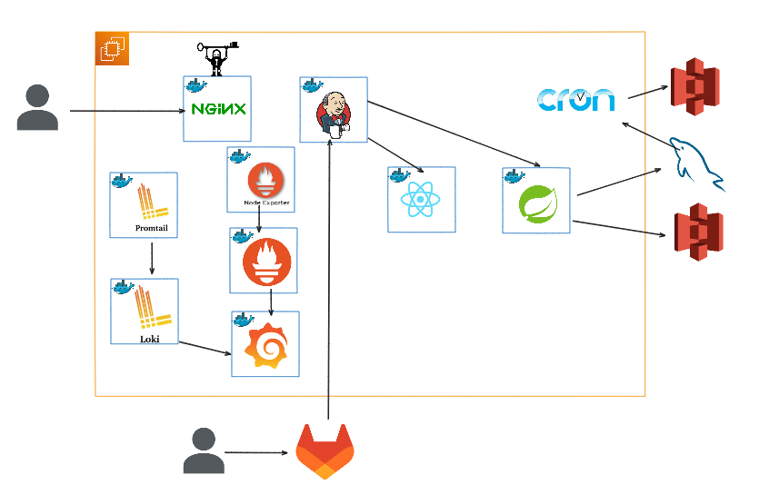

# 🍜 우동 (우리들의 동아리)

동아리 회장을 위한 올-인-원 플랫폼
 
동아리 생성 → 초대코드 가입 → AI 마스코트 → 일정·채팅·투표·정산 → 회비 관리와 공용통장 → 포인트·상점 → MT 일정까지 한 번에!

## 📖 목차

- 프로젝트 소개
- 핵심 기능
- 아키텍처
- 기술 스택
- 아키텍처

## 🎯 프로젝트 소개

우동은 동아리 운영을 위한 일정·채팅·투표·정산·회비 관리·포인트 보상을 한 번에 묶은 서비스입니다.

- 동아리를 만들고 초대코드로 손쉽게 초대
- 생성 즉시 AI 마스코트 자동 생성 (리롤권으로 재생성 가능)
- 공유 캘린더로 이벤트 등록 및 참여 → 참여 시 채팅방 자동 입장
- 정산(1/n), 투표, 회비 징수를 지원하며 공용통장 내역은 투명하게 공개
- 출석/회비 납부/전체 투표 참여 시 포인트 지급 → 상점에서 추가투표권, 마스코트 리롤권 구매 가능
- 동아리원 전체 포인트 합산 → 동아리 포인트 달성 시 회장에게 리롤권 자동 지급
- MT 일정 자동 설계: 날짜·장소·예산을 입력하면 LLM이 일정표를 작성

## ✨ 핵심 기능

### 👥 동아리 & 회원

- 동아리 생성, 초대코드 발급/가입
- 회장/임원/일반 등 역할 관리
- 회원 역할 변경, 추방

### 🎨 AI 마스코트

- 동아리 생성 시 자동 생성
- 리롤권 사용 시 새로운 마스코트 생성

### 📅 일정 & 🗨️ 채팅

- 공유 캘린더에서 이벤트 등록
- 이벤트 참여 → 자동 채팅방 입장
- 실시간 대화, 공지, 이모지 공유

### 💸 정산 & 회비

- 이벤트 정산 생성 및 참여자별 납부 관리
- 회비 징수 등록 및 납부 기록 관리
- 공용통장 내역 공개로 투명한 회계

### 🗳️ 투표

- 단일/복수 선택 지원
- 마감일, 참여율, 상태, 선택 방식 등 표시
- 추가투표권 사용 가능

### 🪙 포인트 & 상점

- 출석/회비 납부/전체 투표 참여 시 포인트 지급
- 상점에서 추가투표권, 마스코트 리롤권 등 구매 가능
- 동아리 포인트 달성 → 회장에게 리롤권 자동 지급

### 🏕️ MT 일정 설계 (LLM)

- MT 정보 입력 → AI가 최적 일정표 자동 생성

## 🏗️ 기술 스택

- Frontend: React, TypeScript, TailwindCSS
- Backend: Spring Boot, REST API
- DB: MySQL, S3
- Infra : Docker, AWS EC2, Nginx, CI/CD  Jenkins, Cron
- Monitoring : Prometheus, Grafana, (Promtail+Loki)

## 🔄 아키텍처

